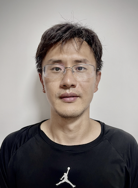
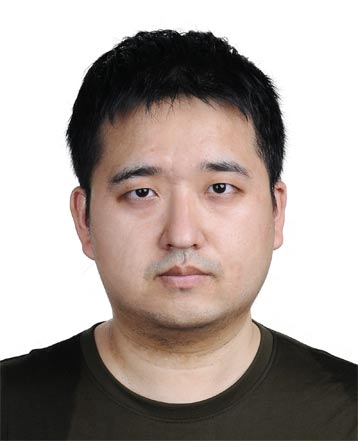
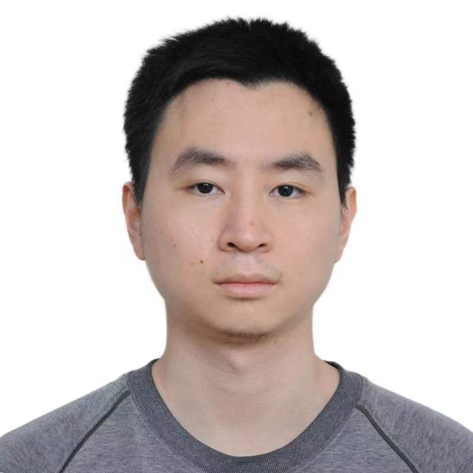

## Members 
### Faculty 

  

[Xiaohui Liu](https://l-x-x.github.io/CV/)  \
Professor \
Principal Investigator 

### Postdoctoral Scholars

  

Hao-Yu Liu (2019 - 2022)\
Now a tenured faculty at the Beijing University of Chemical Technology

### Graduate Students
- Manman Wang (Ph.D. student, 2019 - )\
  small-x physics 

- Haotian Cao (Ph.D. student, 2019 - )\
  EIC-related topics
   
  
  
- Zihao Mi (Ph.D. student, 2022 - )\
  nucleon energy correlators
  
  

- Xiaolin Li (Ph.D. student, 2023 - )\
  spin physics
  
  

- Guorui Li (Ph.D. student, 2023 - )\
  jettiness, nucleon energy correlators in pA collisions
  
  
 
- Jiaqian Sun (Master student, 2018 - 2020)\
  small-x physics\
  Now a high-school teacher in Shenzhen (深圳) 

- Zhan Wang (Master student, 2022 - )\
  nucleon energy correlators in pA collisions 

### Undergraduate Students
- Shan Jin (2018 - 2019), graduated with a PRD paper (first author) on 2-loop N-jettiness soft function and the Beijing outstanding undergraduate thesis award. Next: Peking University to pursue his Ph.D. degree. 
