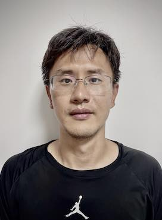
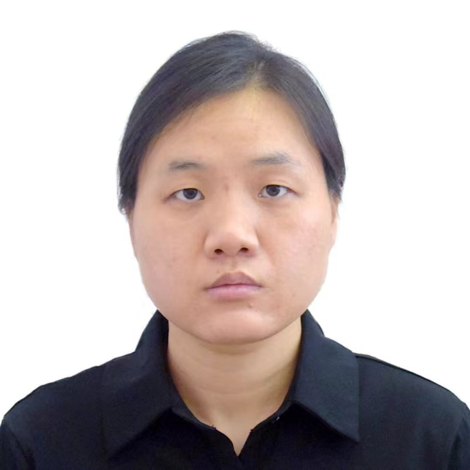

## Members 
### Faculty 

  

[Xiaohui Liu](https://l-x-x.github.io/CV/)  \
Professor \
Principal Investigator 

### Graduate Students
- Manman Wang (Ph.D. student, 2019 - )\
  small-x physics\
  Publications:[2205.04570](https://arxiv.org/abs/2205.04570). 

  
 
- Zhan Wang (Ph.D. student, 2022 - )\
  nucleon energy correlators in pA collisions 

### Previous Members
#### Postdoctoral Scholars

Dr. Hao-Yu Liu (2019 - 2022)\
Now a tenured faculty member at the Beijing University of Chemical Technology

#### Graduate Students
- Dr. Xiaolin Li (Ph.D. student, 2023 - 2026)\
  Multiple offers   

- Dr. Zihao Mi (Ph.D. student, 2022 - 2026)\
  Went to HansCNC (大族数控) in Shenzhen 
  
- Dr. Haotian Cao (Ph.D. student, 2019 - 2024)\
  Moved to Northwestern University and Argonne National Lab as a postdoc research fellow

- Jiaqian Sun (Master student, 2018 - 2020)\
  Now a high-school teacher in Shenzhen (深圳) 

#### Undergraduate Students
- Shan Jin (2018 - 2019), graduated with a PRD paper (first author) on 2-loop N-jettiness soft function and the Beijing outstanding undergraduate thesis award. Now a Ph.D. student at Peking University. 
