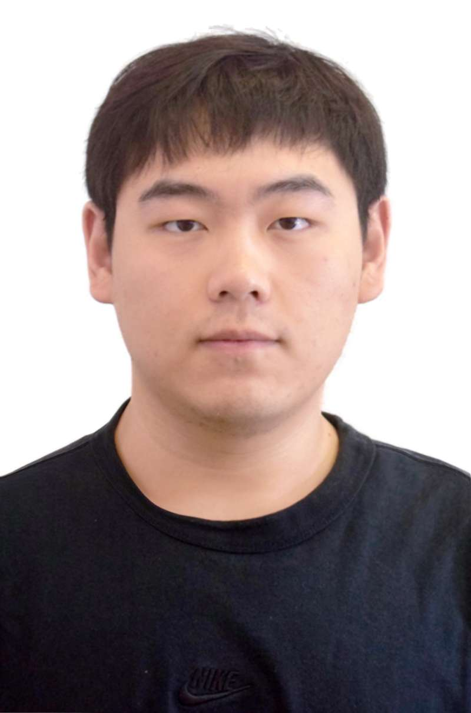

## Members 
### Faculty 

  

[Xiaohui Liu](https://l-x-x.github.io/CV/)  \
Professor \
Principal Investigator 

### Postdoctoral Scholars

  

Hao-Yu Liu (2019 - 2022)\
Now a tenured faculty at the Beijing University of Chemical Technology

### Graduate Students
- Manman Wang (Ph.D. student, 2019 - )\
  small-x physics\
  Publications:[2205.04570](https://arxiv.org/abs/2205.04570). 

  

- Haotian Cao (Ph.D. student, 2019 - )\
  EIC-related topics\
  Publications: [PRD 107 (2023) 11, 114008](https://doi.org/10.1103/PhysRevD.107.114008), [PRD 109 (2024) 9, 096004](https://doi.org/10.1103/PhysRevD.109.096004), [2401.01941 ](https://arxiv.org/abs/2401.01941) 
   
  
  
- Zihao Mi (Ph.D. student, 2022 - )\
  nucleon energy correlators \
  Publications: [2312.07655](https://arxiv.org/abs/2312.07655) 
  
  

- Xiaolin Li (Ph.D. student, 2023 - )\
  spin physics\
  Publications: [Phys. Rev. D 108, L091502](https://doi.org/10.1103/PhysRevD.108.L091502).

  

- Guorui Li (Ph.D. student, 2023 - )\
  jettiness, nucleon energy correlators in pA collisions
  
  
 
- Jiaqian Sun (Master student, 2018 - 2020)\
  small-x physics\
  Now a high-school teacher in Shenzhen (深圳) 

- Zhan Wang (Master student, 2022 - )\
  nucleon energy correlators in pA collisions 

### Undergraduate Students
- Kexin Xie (2021 - 2022), graduated with a JHEP paper on Jet production in forward pA collisions. Now a Ph.D. student at Rice University. 
- Shan Jin (2018 - 2019), graduated with a PRD paper (first author) on 2-loop N-jettiness soft function and the Beijing outstanding undergraduate thesis award. Now a Ph.D. student at Peking University. 
