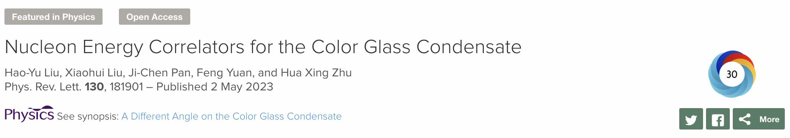

## News
### 2024
- Aug. Xiaohui coordinated the 2nd Workshop on Advanced Topics in Quantum Field Theory in China, which focused on infrared divergence and factorization in QFT this year. The 5-day event took place on the picturesque beach in Qingdao, China, and included 10 engaging talks and numerous thought-provoking discussions.
 
- July. Xiaohui was invited to the [Energy Correlators at the Collider Frontier workshop](https://indico.mitp.uni-mainz.de/event/358/overview) at MITP, Mainz, Germany, and gave a seminar talk on nucleon energy correlators, the talk slides can be found [here](https://indico.mitp.uni-mainz.de/event/358/contributions/5004/attachments/3607/4681/neec-eccf.pdf)
   
- May. Congrats to Hao-tian on passing his Ph.D. defense. He will be a postdoc research fellow at ANL and Northwestern U. this September.
  
- March. Our previous [work](https://journals.aps.org/prl/abstract/10.1103/PhysRevLett.130.181901) about a new method to explore gluon saturation is now highlighted by the Dept. of Energy, USA. [Read the highlight](https://science.osti.gov/np/Highlights/2024/3e).
  
- Jan. Congrats to Hao-tian on getting the post-doc offer from Argonne National Lab and Northwestern University, starting in Sep. 2024.
  
### 2023
- Aug. Congrats to my former Postdoc Hao-yu Liu (now a faculty member at Beijing University of Chemical Technology）
  being granted the Young Scientists Fund of the National Natural Science Foundation of China (国自然青年基金, with only an 18% support rate!)

- Aug. Xiaohui is helping organize a [celebration event](https://indico.ihep.ac.cn/event/19797/) for 50 years of QCD at the Center for High Energy Physics, Peking University. Read the [news](https://rchep.pku.edu.cn/info/1034/1200.htm) for more details (in Chinese). 
  
- Aug. Manman Wang is helping me to organize the first International Physics Summer School of the physics department. We are honored to have Anthony Zee (徐一鸿, Member of the American Academy of Arts and Sciences) and Alfred Mueller (Member of the American Academy of Arts and Sciences, Sakurai Prize Winner) to deliver public lectures. See the [news](https://news.bnu.edu.cn/zx/zhxw/a3062beb4e5348a681e6c30935719363.htm) for more details (in Chinese).

- June. Our PRL paper *[Nucleon Energy Correlators for the Color Glass Condensate](https://journals.aps.org/prl/abstract/10.1103/PhysRevLett.130.181901)* is featured as Synopsis in the *PHYSICS*: [A Different Angle on the Color Glass Condensate](https://physics.aps.org/articles/v16/s89).

     

### Random News before 2023 
- Congratulations to Dr. Hao-yu Liu for accepting the Beijing University of Chemical Technology offer as a tenured faculty.
- Congratulations to our Postdoc Hao-yu Liu for receiving funding from the China Postdoctoral Science Foundation in 2021.
- Xiaohui was awarded the National Top Young Scholar.
- We successfully organized the BNU Summer School for Collider Phenomenology. The Summer school took place in July 2021 on the picturesque coast of the Yellow Sea (黄海). The summer school was originally scheduled earlier in 2020 but postponed due to the pandemic. Some lecture notes can be found [here](https://indico.ihep.ac.cn/event/11211/timetable/#20210705). 
- Xiaohui received the Pengnian Outstanding Young Teacher Award (Graduate Teaching).
- Xiaohui visited UCLA for a week and gave a seminar talk on [Precision Phenomenology at Hadron Colliders](https://nuclear.physics.ucla.edu/sites/default/files/xiaohui-liu.pdf). 
- Xiaohui received grants from the National Natural Science Foundation of China on jet physics.
- Xiaohui received grants from the National Natural Science Foundation of China for summer school for collider phenomenology.
- We organized three consecutive BNU dark matter workshops in 2017 (Beijing),2018 (Beijing), and 2019 (Zhuhai). The 2019 workshop took place shortly before the outbreak of the pandemic. 
- We were happy to have Prof. Zhong-bo Kang from UCLA visiting our group for a week.
- We were happy to have Prof. Hsiang-nan Li from the Institute of Physics, Academia Sinica visiting us and giving a Seminar talk.
- We were happy to host Prof. Xiangdong Ji from the University of Maryland, College Park for a short visit to the Physics Department.
- Xiaohui visited DESY as the [Theorist of the Month](https://www.terascale.de/research_topics/rt1_physics_analysis/analysis_centre/theorist_of_the_month/) in Jan. 2018.
- Xiaohui received grants from the National Natural Science Foundation of China on the LHC phenomenology precision predictions.
- Xiaohui was invited to give a review talk on the current status of the [NNLO QCD predictions](https://indico.fnal.gov/event/11999/contributions/11441/attachments/7400/9502/dpf2017.pdf) for the LHC at the 2017 Meeting of the APS Division of Particles and Fields held in Fermi Lab.
- Xiaohui was invited to the Aspen Summer Program, Reaching New Summits: The LHC at Full Strength. 
- Xiaohui was invited to the KITP follow-up one-week program on the LHC Precision Frontier in Santa Barbara. 
