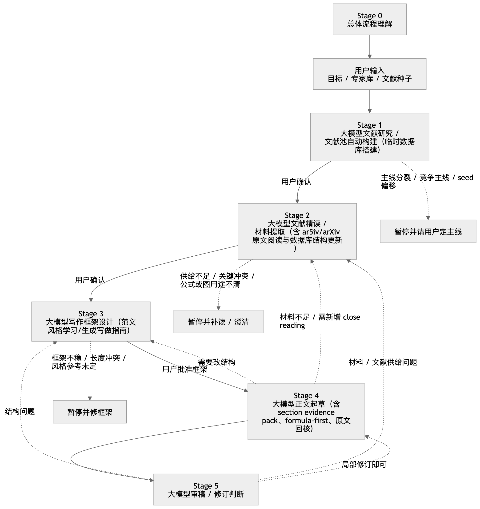
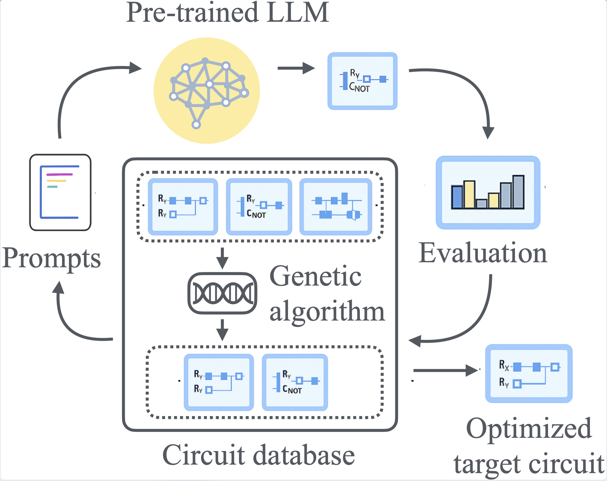
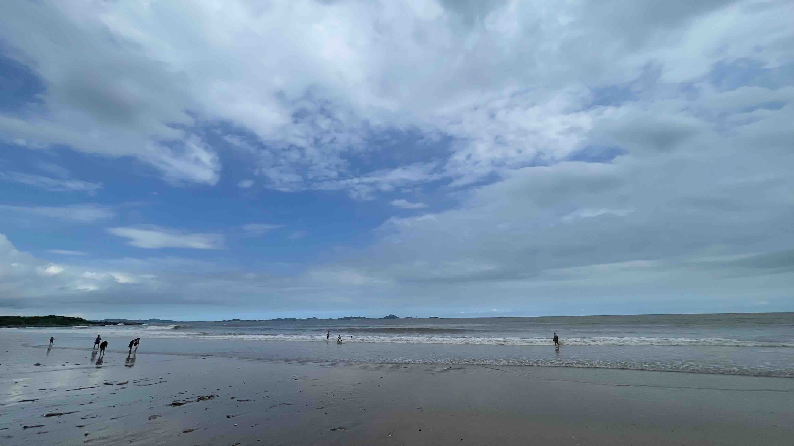
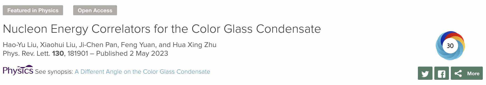

## News
### 2026
- April 8 - April 12. We are happy to have Joao Barata visit us and give a talk on Heavy Ion Physics. Joao is currently a postdoc at CERN and will start his faculty position at the Brookhaven National Lab this fall.

- March. Xiaohui wrote (well, AI wrote) a set of writing protocols （～160KB prompt file and now upgraded to ~200KB), trying to automate the research writing by ChatGPT. The workflow is given here

      
  The protocols are designed for AI coding agents, while a test was conducted using ChatGPT-5.4-thinking, operating through a webpage, and relying on its sandbox service. Before writing, the AI is required to do in-depth reference research based on the user's writing  motivation. At the beginning (forced) and end (strongly suggested) of each stage, the files generated are audited to meet the protocol requirements. The conversation used to write a regular research paper can be found [here](https://l-x-x.github.io/news/regular-article-ai.pdf), and for a review paper, see [here](https://l-x-x.github.io/news/review-article-ai.pdf). Compared with writing (stage 3 and stage 4), It is more interesting to observe the learning process: how the LLM becomes aware of potential mistakes in the provided (unchecked) equations and references and how, by reading the references in Stage 2, it builds a clear picture of the research—including its history, connections between different papers, and trends. Here is an exemplary [review article](https://l-x-x.github.io/news/energy_correlators_polished.pdf) on the Energy Correlator using this procedure with minimal human input, and ZERO touch of the draft. Here is another example for the protocols used for [proposal-writing](https://l-x-x.github.io/news/proposal-writing.pdf) (**FOR TEST ONLY**) and a layer for [polishing and final draft](https://l-x-x.github.io/news/polishing.pdf). 

- March 2 - March 5. Zhan Wang gave a talk on our ongoing work about [the possible novel precision extraction of the strong coupling constant using EEC in the post-confinement region](https://indico.nuclear.korea.ac.kr/event/87/contributions/391/attachments/278/423/ZhanWang_SECT26.pdf) at the XXIII Annual Workshop on Soft-Collinear Effective Theory held at the Korea Institute for Advanced Study (KIAS) in Seoul, Korea. Another student collaborator, Shu-Tao Zhang from Peking University, presented our work on the [fragmentation energy correlator](https://indico.nuclear.korea.ac.kr/event/87/contributions/387/attachments/279/424/SCET_FEC.pdf) at the same workshop.
  
- January. Xiaohui has been awarded a Chinese NSF grant of 300 million RMB for research on new avenues into the nucleon structure. The funding period runs from 2026 to 2029. 

### 2025
- October 22 - October 24. Xiaohui was invited to give a talk on "Energy Correlators for the Future EIC" at the KPS fall meeting held in Gwangju, Korea. 

- July 14 - July 15. Xiaohui was invited to give a lecture on TMD physics at Shandong University, Jinan. The lecture notes can be found [here](https://l-x-x.github.io/qft-2019/TMD-lecture-shanda.pdf).
  
- July 6 - July 10. Xiaohui was invited to visit the CERN TH HI group and gave a TH Heavy Ion Coffee Seminar on the topic of [EEC for Non-perturbative QCD](https://indico.cern.ch/event/1563011/). 
  
- May 6 - May 16. We recently hosted a two-week program at [C3NT](https://c3nt.ccnu.edu.cn/) titled ["New Opportunities in Particle and Nuclear Physics with Energy Correlators" (能量关联子：粒子物理与核物理研究的新机遇)](https://indico.ihep.ac.cn/event/24880/). This gathering not only fostered vibrant scientific exchange but also provided a welcoming space for participants to reconnect with colleagues and forge new connections. The program was marked by thought-provoking discussions, collaborative brainstorming, and fresh insights into the transformative potential of energy correlators across these fields.
All presentations from the event are now available online [here](https://indico.ihep.ac.cn/event/24880/timetable/#20250505).

- Mar. In a recent [work](http://arxiv.org/abs/2505.06347), we proposed using LLM (DeepSeek-Distill-Qwen-32B) + feedback + genetic algorithm to automate quantum state preparation on quantum circuits. More refined results are on the way. At the moment, the Pros we found:
 ✅ Works with natural language prompts (no physics specs like boundaries/symmetry/Hamiltonian).
 ✅ Finds optimal circuits for Ising/XY model ground states in O(10-100) hrs—no expert input, strict parameter  limits.
 ✅ Circuits scale to larger systems.
 ✅ LLM intuitively proposed a boundary-sensitive, symmetry-preserving rotation, hinting at "learning" physics.......
 Importantly, the framework is not limited to quantum circuit design but has a broad application in science.  If we frame everything as a search problem, AI will surpass humans, given good evaluation + evolution. However, designing those is hard, and evaluation costs can break the system.

     

  
- Mar. Xiaohui is invited to the Hadronic Interaction Workshop hosted by the Chinese University of Hong Kong. The workshop aimed to explore the potential applications of small-x physics in high-energy cosmic ray experiments at LHAASO. It is interesting to note that what the LHAASO experiment measures, the so-called energy flow, is nothing but the nucleon energy correlator we proposed to understand the nucleon/nucleus internal structures. 

- Jan.  We are happy to have Dr. Ning Su from Caltech & MIT visit us and give a seminar on [Bootstrap Meets Experimental Data](https://multiscale.bnu.edu.cn/xsbg/51e3c055679a44f0b96e717aaa50569c.htm).

- Jan. Xiaohui gave lectures on perturbative QCD at the "New Physics Winter School" hosted by Sun Yat-sen University, Shenzhen. Lecture notes can be found [here](https://l-x-x.github.io/teaching/). 
  
### 2024
- Nov. We are happy to have Dr. Kyle Lee from MIT give a seminar on [energy correlators](https://physics.bnu.edu.cn/docs/2024-10/d6ced4a28fa44e29bf068f284354b89d.pdf).
  
- Aug. Xiaohui coordinated the 2nd Workshop on Advanced Topics in Quantum Field Theory in China, focusing on infrared divergence and factorization in QFT this year. The 5-day event took place on the picturesque beach in the City of Qingdao and included ten engaging talks and numerous thought-provoking discussions.
  
  
 
- July. Xiaohui was invited to the [Energy Correlators at the Collider Frontier workshop](https://indico.mitp.uni-mainz.de/event/358/overview) at MITP, Mainz, Germany, and gave a seminar talk on nucleon energy correlators, the talk slides can be found [here](https://indico.mitp.uni-mainz.de/event/358/contributions/5004/attachments/3607/4681/neec-eccf.pdf)
   
- May. Congrats to Hao-tian on passing his Ph.D. defense. He will be a postdoc research fellow at ANL and Northwestern U. this September.
  
- March. Our previous [work](https://journals.aps.org/prl/abstract/10.1103/PhysRevLett.130.181901) about a new method to explore gluon saturation is now highlighted by the Dept. of Energy, USA. [Read the highlight](https://science.osti.gov/np/Highlights/2024/3e).
  
- Jan. Congrats to Hao-tian on getting the post-doc offer from Argonne National Lab and Northwestern University, starting in Sep. 2024.
  
### 2023
- Aug. Congrats to my former Postdoc Hao-yu Liu (now a faculty member at Beijing University of Chemical Technology）
  being granted the Young Scientists Fund of the National Natural Science Foundation of China (国自然青年基金, with only an 18% support rate!)

- Aug. Xiaohui is helping organize a [celebration event](https://indico.ihep.ac.cn/event/19797/) for 50 years of QCD at the Center for High Energy Physics, Peking University. Read the [news](https://rchep.pku.edu.cn/info/1034/1200.htm) for more details (in Chinese). 
  
- Aug. Manman Wang is helping me to organize the first International Physics Summer School of the physics department. We are honored to have Anthony Zee (徐一鸿, Member of the American Academy of Arts and Sciences) and Alfred Mueller (Member of the American Academy of Arts and Sciences, Sakurai Prize Winner) to deliver public lectures. See the [news](https://news.bnu.edu.cn/zx/zhxw/a3062beb4e5348a681e6c30935719363.htm) for more details (in Chinese).

- June. Our PRL paper *[Nucleon Energy Correlators for the Color Glass Condensate](https://journals.aps.org/prl/abstract/10.1103/PhysRevLett.130.181901)* is featured as Synopsis in the *PHYSICS*: [A Different Angle on the Color Glass Condensate](https://physics.aps.org/articles/v16/s89).

     

### Random News before 2023 
- Congratulations to Dr. Hao-yu Liu for accepting the Beijing University of Chemical Technology offer as a tenured faculty.
- Congratulations to our Postdoc Hao-yu Liu for receiving funding from the China Postdoctoral Science Foundation in 2021.
- Xiaohui was awarded the National Top Young Scholar.
- We successfully organized the BNU Summer School for Collider Phenomenology. The Summer school took place in July 2021 on the picturesque coast of the Yellow Sea (黄海). The summer school was originally scheduled earlier in 2020 but postponed due to the pandemic. Some lecture notes can be found [here](https://indico.ihep.ac.cn/event/11211/timetable/#20210705). 
- Xiaohui received the Pengnian Outstanding Young Teacher Award (Graduate Teaching).
- Xiaohui visited UCLA for a week and gave a seminar talk on [Precision Phenomenology at Hadron Colliders](https://nuclear.physics.ucla.edu/sites/default/files/xiaohui-liu.pdf). 
- Xiaohui received grants from the National Natural Science Foundation of China on jet physics.
- Xiaohui received grants from the National Natural Science Foundation of China for summer school for collider phenomenology.
- We organized three consecutive BNU dark matter workshops in 2017 (Beijing),2018 (Beijing), and 2019 (Zhuhai). The 2019 workshop took place shortly before the outbreak of the pandemic. 
- We were happy to have Prof. Zhong-bo Kang from UCLA visiting our group for a week.
- We were happy to have Prof. Hsiang-nan Li from the Institute of Physics, Academia Sinica visiting us and giving a Seminar talk.
- We were happy to host Prof. Xiangdong Ji from the University of Maryland, College Park for a short visit to the Physics Department.
- Xiaohui visited DESY as the [Theorist of the Month](https://www.terascale.de/research_topics/rt1_physics_analysis/analysis_centre/theorist_of_the_month/) in Jan. 2018.
- Xiaohui received grants from the National Natural Science Foundation of China on the LHC phenomenology precision predictions.
- Xiaohui was invited to give a review talk on the current status of the [NNLO QCD predictions](https://indico.fnal.gov/event/11999/contributions/11441/attachments/7400/9502/dpf2017.pdf) for the LHC at the 2017 Meeting of the APS Division of Particles and Fields held in Fermi Lab.
- Xiaohui was invited to the Aspen Summer Program, Reaching New Summits: The LHC at Full Strength. 
- Xiaohui was invited to the KITP follow-up one-week program on the LHC Precision Frontier in Santa Barbara. 
