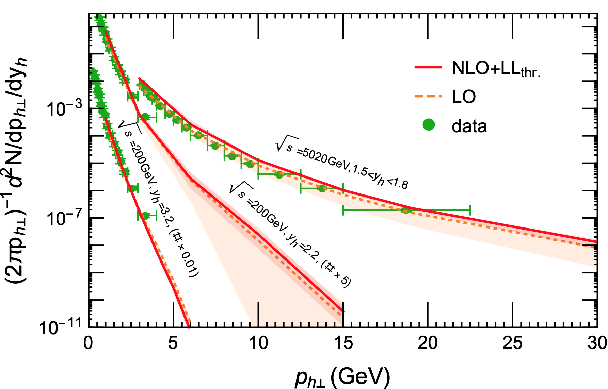

## High Energy Nuclear Physics

These days, I put my major research focus on high energy nuclear physics which uses hard probes to extract non-perturbative information on the nucleon/nucleus internal structures. Long-term research includes the usage of jets to probe the so-called nucleon TMDs or spins. I am also planning to do systematic studies on small-x physics. Both TMD and small-x physics are the main scientific motivations for the planned electron-ion collider in the US. 

Works done in this direction include:

- Z.B. Kang, Xiaohui Liu, S. Mantry, D. Shao, Jet Charge: A Flavor Prism for Spin Asymmetries at the EIC, Phys.Rev.Lett. 125 (2020) 242003. 
- Z.B. Kang and Xiaohui Liu*, Power counting the small-x physics, 1910.10166. 
- Xiaohui Liu, F. Ringer, W. Vogelsang, F. Yuan, Lepton-jet Correlations in Deep Inelastic Scattering at the Electron-Ion Collider, Phys.Rev.Lett. 122 (2019) no.19, 192003.
- M. Buffing, Z.B.Kang, K.Lee, Xiaohui Liu*, A transverse momentum dependent framework for back-to-back photon+jet production
arXiv:1812.07549.

