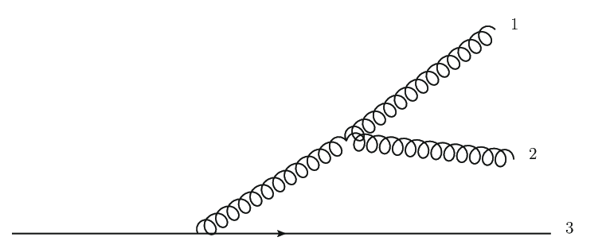

## Precision QCD

Particle colliders are essential tools in particle physics as they allow us to explore and understand the fundamental nature of our universe. To make predictions about the phenomena observed in collider experiments, we rely on perturbative QCD (Quantum Chromodynamics) or perturbative field theories. This approach is currently the most effective method for predicting collider phenomenology based on fundamental principles.

Perturbative QCD works by expanding the predictions in terms of the strong coupling constant. These expansions are done to different orders, such as leading order, next-to-leading order, and so on, allowing us to approximate the behavior of particles and interactions in reality gradually. In the past few years, around 2016, there has been significant interest in Next-to-Next-to-Leading Order (NNLO) QCD predictions, which have proven highly valuable in collider physics for precision measurements and data descriptions. Recently, the forefront of the research area has marched to the NNNLO calculations. 

In realizing QCD higher-order corrections, one subtlety is to handle the divergences arising in the multiple parton (gluons and quarks) emissions in the calculation. Those divergences occur when the partons become degenerate, for instance, either when parton 1, parton 2, and parton 3 in the Figure shown below become collinear and propagate in exactly the same direction, or when any one of them becomes soft with zero energy.    

  

One intriguing work of our research revolves around the development of the jettiness subtraction scheme. This scheme utilizes the physical observable named jettiness to isolate the divergence. A rough description of the scheme can be found in this talk [video](http://s3-us-west-2.amazonaws.com/kitpcloud/lhc16/Liu_LHC16_KITP.mp4) I gave at the KITP, Santa Barbara when I was still young and round. 

This scheme has helped to achieve NNLO predictions for processes involving the production of W, Z, or H bosons along with jets in proton-proton collisions, among other interesting processes studied at the Large Hadron Collider (LHC). Ongoing studies in this field include understanding power corrections, improving the phase space generator, and exploring its applications to various collider processes. Recently we are pushing the scheme to its NNNLO capability by calculating one of its building blocks, the soft function, to the NNNLO accuracy. 

In recent years, my research focus is gradually moving away from this area due to various reasons. But overall, precision QCD and the ongoing advancements in techniques like the jettiness subtraction scheme play a crucial role in our ability to understand and describe the complex phenomena observed in particle colliders.

Some related works are
- W. Chen, F. Feng, Y. Jia and Xiaohui Liu*, Double-Real-Virtual and Double-Virtual-Real Corrections to the Three-Loop Thrust Soft Function, JHEP 12 (2022) 094. 
- R. Boughezal, Xiaohui Liu*, F. Petriello, Power Corrections in the N-jettiness Subtraction Scheme, JHEP 1703 (2017) 160.  
- R. Boughezal, Xiaohui Liu*, F. Petriello, N-jettiness soft function at next-to-next-to-leading order, Phys. Rev. D 91 (2015) no.9, 094035.  
- R. Boughezal, C. Focke, Xiaohui Liu*, F. Petriello, W-boson production in association with a jet at next-to-next-to-leading order in perturbative QCD, Phys. Rev. Lett. 115 (2015) no.6, 062002.  
